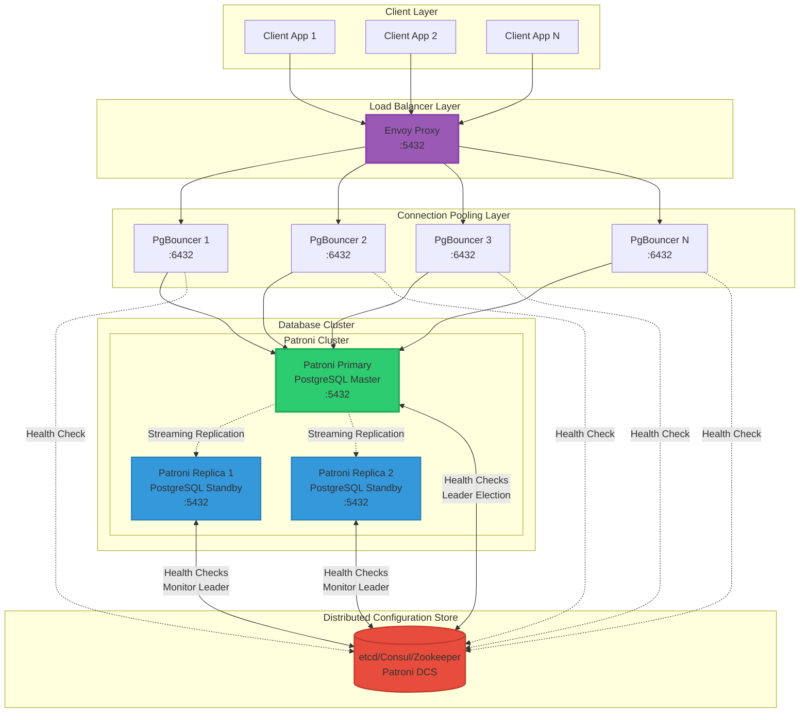

# PostgreSQL with Patroni, Envoy, and PgBouncer Fleet

Basic production setup with high availability and connection pooling.

## Components

- **Client Layer**: Applications connecting to the database
- **Envoy Proxy**: Single entrypoint for all client connections, load balances across PgBouncers
- **PgBouncer Fleet**: Multiple connection poolers that reduce connection overhead to PostgreSQL
- **Patroni Cluster**:
  - Primary node (green) handling writes
  - Replica nodes (blue) for read scaling
  - Streaming replication between nodes
- **DCS (etcd/Consul/Zookeeper)**: Stores cluster state, handles leader election, enables automatic failover

## Features

- High availability via Patroni automatic failover
- Connection pooling via PgBouncer fleet
- Load distribution via Envoy
- Streaming replication for data redundancy
