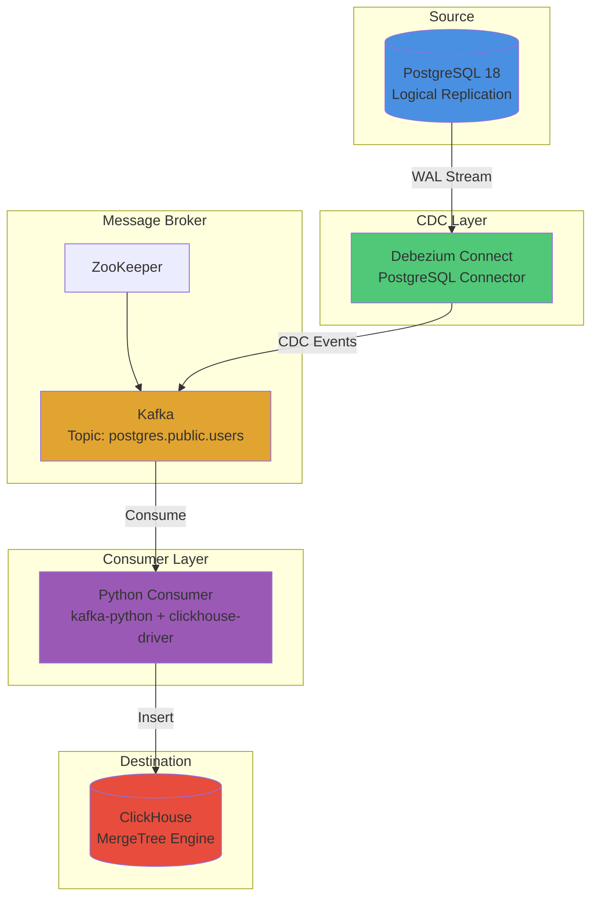
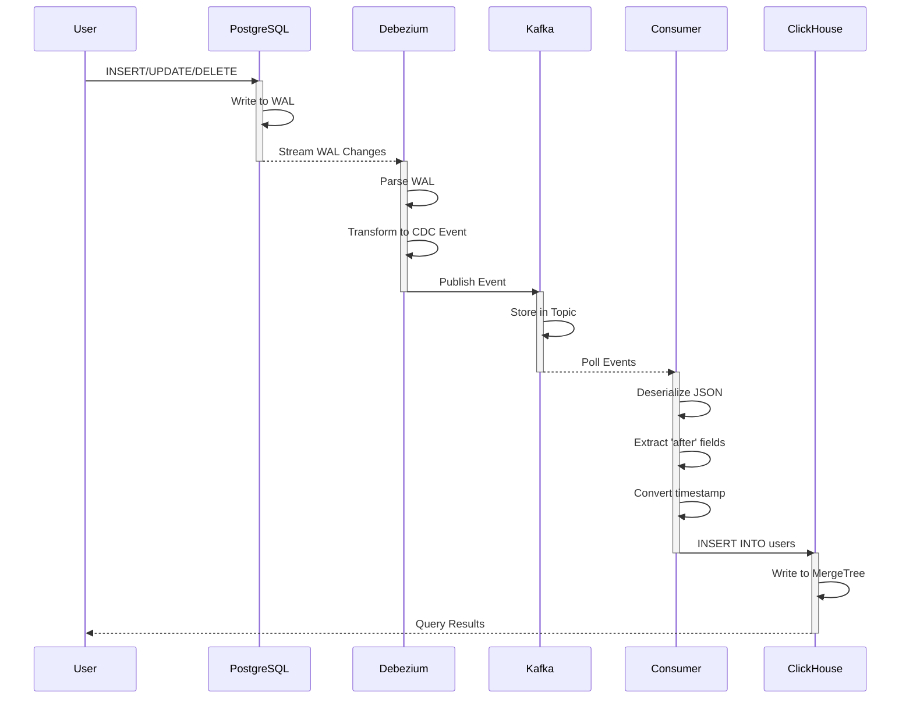
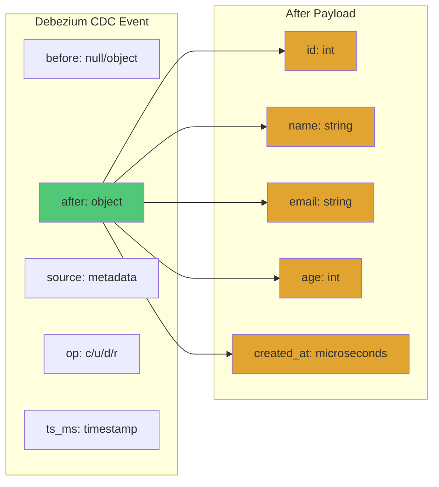
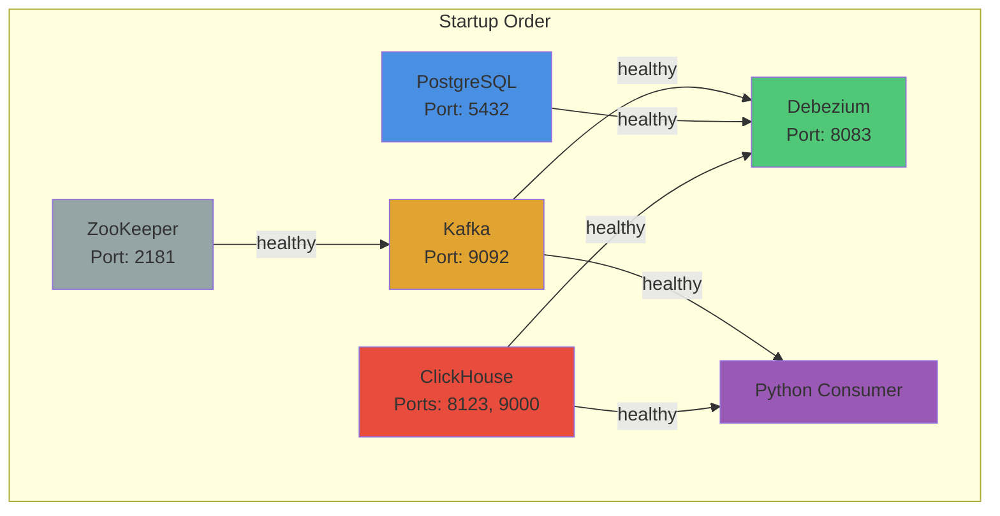
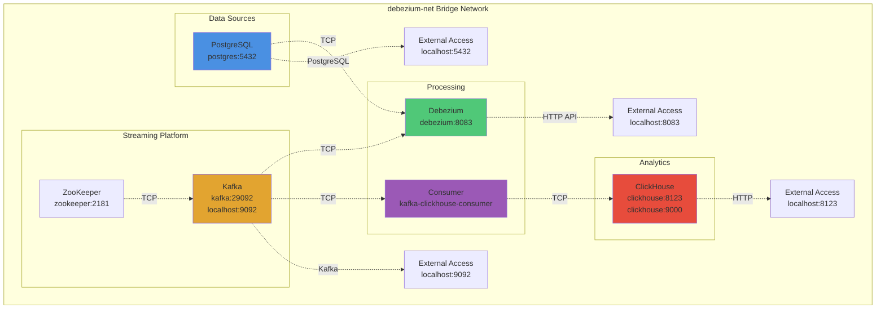
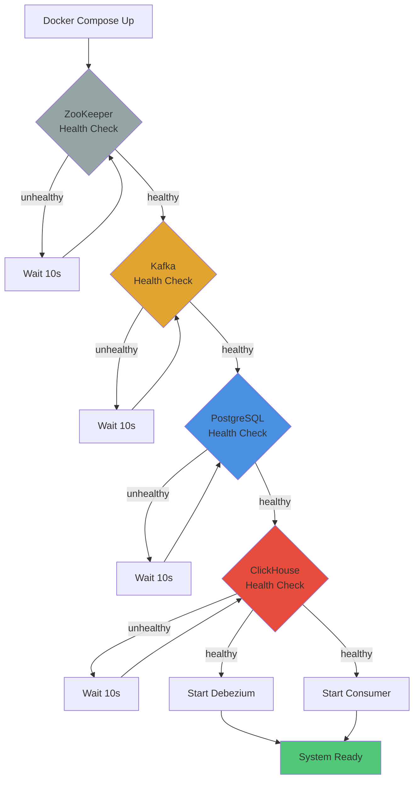

# Architecture & Flow Diagrams

This document contains comprehensive Mermaid diagrams illustrating the CDC pipeline architecture, data flows, and operational patterns.

## Table of Contents
1. [System Architecture](#system-architecture) - High-level component view
2. [Data Flow Sequence](#data-flow-sequence) - Step-by-step data movement
3. [CDC Event Structure](#cdc-event-structure) - Debezium event format
4. [Container Dependencies](#container-dependencies) - Service startup order
5. [Network Topology](#network-topology) - Network configuration
6. [Change Data Capture Flow](#change-data-capture-flow) - Detailed CDC process
7. [Health Check Flow](#health-check-flow) - Container health checks
8. [Operations Overview](#operations-overview) - INSERT/UPDATE/DELETE handling

---

## System Architecture

## Data Flow Sequence

## CDC Event Structure

## Container Dependencies

## Network Topology

## Change Data Capture Flow

```mermaid
flowchart LR
    subgraph "PostgreSQL"
        T[users table]
        W[Write-Ahead Log<br/>wal_level=logical]
        T -->|writes| W
    end

    subgraph "Debezium"
        R[Replication Slot]
        P[pgoutput Plugin]
        T1[Transform]

        W -->|stream| R
        R -->|decode| P
        P -->|enrich| T1
    end

    subgraph "Kafka Topic"
        PT[postgres.public.users]
        T1 -->|publish| PT
    end

    subgraph "Consumer"
        C[Poll Messages]
        D[Deserialize]
        E[Extract Data]
        F[Transform DateTime]

        PT -->|consume| C
        C --> D
        D --> E
        E --> F
    end

    subgraph "ClickHouse"
        I[INSERT Statement]
        M[MergeTree Table]

        F --> I
        I --> M
    end

    style W fill:#4A90E2
    style P fill:#50C878
    style PT fill:#E2A430
    style F fill:#9B59B6
    style M fill:#E74C3C
```

## Health Check Flow

## Operations Overview

```mermaid
graph TB
    subgraph "INSERT Operation"
        I1[User inserts row] -->|SQL| I2[PostgreSQL writes to WAL]
        I2 --> I3[Debezium captures INSERT]
        I3 --> I4[op: 'c' for create]
        I4 --> I5[after: full record]
        I5 --> I6[Consumer INSERTs to ClickHouse]
    end

    subgraph "UPDATE Operation"
        U1[User updates row] -->|SQL| U2[PostgreSQL writes to WAL]
        U2 --> U3[Debezium captures UPDATE]
        U3 --> U4[op: 'u' for update]
        U4 --> U5[before: old values<br/>after: new values]
        U5 --> U6[Consumer INSERTs to ClickHouse<br/>MergeTree handles duplicates]
    end

    subgraph "DELETE Operation"
        D1[User deletes row] -->|SQL| D2[PostgreSQL writes to WAL]
        D2 --> D3[Debezium captures DELETE]
        D3 --> D4[op: 'd' for delete]
        D4 --> D5[before: deleted record<br/>after: null]
        D5 --> D6[Consumer skips<br/>delete.enabled: false]
    end

    style I3 fill:#50C878
    style U3 fill:#E2A430
    style D3 fill:#E74C3C
```

