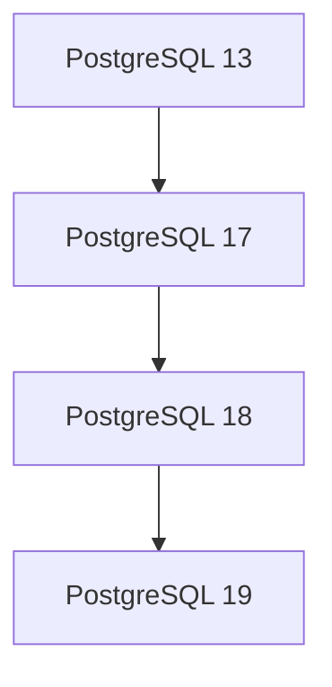

# Logical Replication Lab

## Overview

This lab demonstrates the use of logical replication in PostgreSQL.

## Architecture



## Quick Start

```bash
docker compose build
docker compose up -d
```

```bash
./monitor.sh
```

## Model

Both origin and destination are using _not exactly_ the same model for example purposes.
The intention here is to show that types that share the same primitives and compatible casts, can be replicated. eg. from `int` to `bigint`, `varchar` to `text`, etc.


## Cleanup

```bash
docker compose down
```