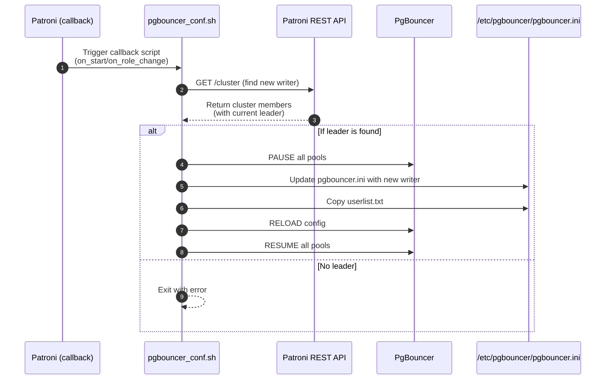

# Patroni implementations

### Patroni Callbacks

This shows the steps performed by `pgbouncer_conf.sh` when Patroni triggers it as a callback on start or role change. The script queries Patroni for the current leader, updates PgBouncer’s configuration, reloads it, and resumes pools in order.

The scripts emulates our _seamless switchover_ process.

