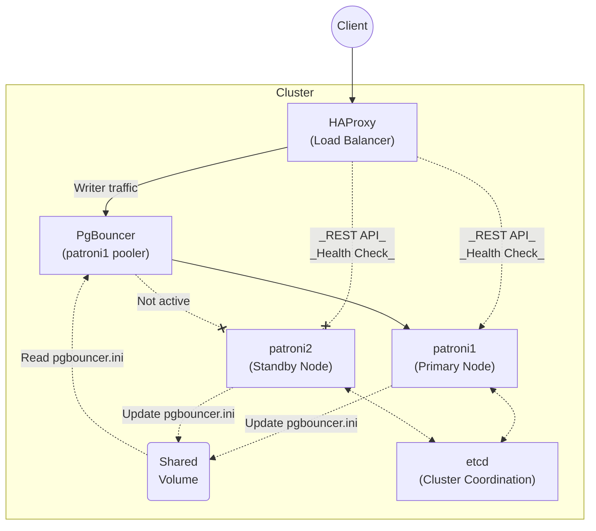

# Local Patroni Docker Compose setup for testing connection resilience

This setup provides a highly available PostgreSQL 17 cluster using Patroni with 2 nodes, PgBouncer connection pooling, and HAProxy for automatic failover.

## Architecture




The connection flow is: **Client → HAProxy (port 5432) → PgBouncer → Patroni → PostgreSQL**.
See [Sequence](./PATRONI.md).

HAProxy performs health checks directly against Patroni REST API endpoints to determine the current primary node, then routes traffic through the corresponding PgBouncer instance.

> For the sake of the test, we only have 1 available Patroni node to connect through HAProxy/PgBouncer.

> On **failover** or **switchover**, the Patroni will change the [databases] section through `callbacks` scripts.


## Ports

| Port    | Service / Endpoint                  | Description                                  |
|---------|-------------------------------------|----------------------------------------------|
| **5432**  | HAProxy (PostgreSQL writer)         | Client connects here                       |
| **7001**  | HAProxy (stats)                     | HAProxy stats page                           |
| **15432** | patroni1                            | patroni1 direct PostgreSQL access            |
| **15433** | patroni2                            | patroni2 direct PostgreSQL access            |
| **6432**  | pgbouncer                           | pgbouncer direct access                      |
| **8008**  | patroni1                            | patroni1 REST API                            |
| **8009**  | patroni2                            | patroni2 REST API                            |
| **2379**  | etcd                                | etcd client port                             |

## Monitoring

| Service                   | URL                         |
|---------------------------|-----------------------------|
| **HAProxy Stats**         | http://localhost:7001       |
| **Patroni REST API Node 1** | http://localhost:8008    |
| **Patroni REST API Node 2** | http://localhost:8009    |


## Quick Start

You can use the `Makefile` wrapper instead `docker compose`, as it is more convenient:

```bash
make build
make up
make list
make switchover
make down
make clean
```

- PostgreSQL password in `userlist.txt`:
  - `postgres`: postgres
  

Connect to PostgreSQL via HAProxy (writer endpoint):

```bash
PGPASSWORD=postgres psql -h localhost -p 5432 -U postgres
```

You can connect directly to PgBouncer instances for testing:

```bash
# Connect to pgbouncer
PGPASSWORD=postgres psql -h localhost -p 6432 -U postgres
```


Access PgBouncer admin console:
```bash
psql -h localhost -p 6432 -U postgres -d pgbouncer
SHOW POOLS;
SHOW DATABASES;
SHOW STATS;
```


Check cluster status:
```bash
docker exec -it patroni1 patronictl -c /etc/patroni/patroni.yml list
```


## Testing Failover

```bash
$ docker compose stop patroni1     
[+] Stopping 1/1
 ✔ Container patroni_node1  Stopped   

$ docker compose exec -it patroni2 patronictl -c /etc/patroni/patroni.yml list
+ Cluster: postgres-cluster (7563338035156443159) -----------+-----+------------+-----+
| Member   | Host     | Role    | State   | TL | Receive LSN | Lag | Replay LSN | Lag |
+----------+----------+---------+---------+----+-------------+-----+------------+-----+
| patroni1 | patroni1 | Replica | stopped |    |     unknown |     |    unknown |     |
| patroni2 | patroni2 | Leader  | running |  3 |             |     |            |     |
+----------+----------+---------+---------+----+-------------+-----+------------+-----+
```


## Manual Switchover

To perform a planned switchover to a specific node:

```bash
docker exec -it patroni1 patronictl -c /etc/patroni/patroni.yml switchover 
```

The below will force the switchover:

```bash
make switchover
```

## Testing connections with switchover/failover


- Initiate pgbench schema and run a long running bench:


  ```bash
  PGPASSWORD=postgres /Applications/Postgres.app/Contents/Versions/17/bin/pgbench -i  -h localhost -p 5432 -U postgres postgres 
  PGPASSWORD=postgres /Applications/Postgres.app/Contents/Versions/17/bin/pgbench -T 700 -P 10 -C --max-tries=10 -h localhost -p 5432 -U postgres postgres
  ```

> `-C` option opens a new connection _per transaction_. 

- Switchover
  ```bash
  make switchover
  ```
- Failover
  - Get the **leader** `make list` and execute `docker compose stop patroniN`.


## Stopping the Cluster

```bash
make down
```

Cleaning: `make clean`.
