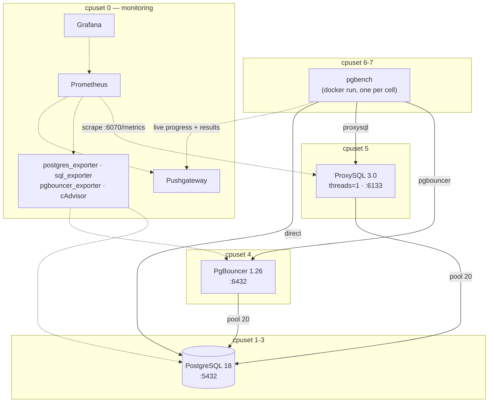
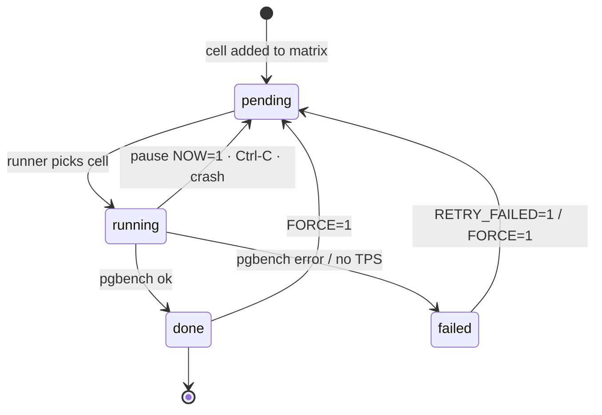
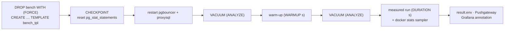

# pool-single-thread — PgBouncer vs ProxySQL (single thread)

This lab measures how much **throughput and latency** each connection pooler can handle on **one CPU core**, in front of one PostgreSQL 18 instance. It compares three targets:

| target      | path                              | why                                                        |
|-------------|-----------------------------------|------------------------------------------------------------|
| `direct`    | pgbench → Postgres :5432          | Baseline with no pooler: the most Postgres can do, and what each pooler costs |
| `pgbouncer` | pgbench → PgBouncer :6432 → PG    | Single-threaded by design                                  |
| `proxysql`  | pgbench → ProxySQL :6133 → PG     | PostgreSQL module, set to `pgsql-threads=1`                |

## Stack

| component | version | notes |
|---|---|---|
| PostgreSQL | `postgres:18` (18.x stable) | dataset fits in `shared_buffers`; `synchronous_commit=off` |
| PgBouncer | 1.26.0, built from the release tarball (`docker/pgbouncer/Dockerfile`) | `pool_mode=transaction` |
| ProxySQL | `proxysql/proxysql:3.0.10` (stable tier) | `threads=1`, `multiplexing=true`, monitor off |
| Load generator | `pgbench` from the `postgres:18` image (`docker run`, one container per cell) | |
| Metrics | Prometheus, postgres_exporter, sql_exporter, pgbouncer_exporter, ProxySQL built-in `/metrics` (REST API :6070), cAdvisor, Pushgateway | |
| Dashboards | Grafana, provisioned from `docker/grafana/gen_dashboards.py` | |



### Fairness rules

- Each pooler is pinned to **one dedicated core** (`cpuset`). Postgres, the load generator and the monitoring stack each get their own cores, so they don't compete with the poolers for CPU.
- Both poolers use the same backend pool (20 connections), transaction-level pooling and SCRAM-SHA-256 authentication with clear-text secrets.
- If you change the pool size, edit **both** `docker/pgbouncer/pgbouncer.ini` and `docker/proxysql/proxysql.cnf`.
- `pgbench` connects once at the start of each run (no `-C`). TPS is reported without the initial connection time, so authentication cost is not measured.
- The dataset is small (scale 10, ≈150 MB data + orders). The goal is that Postgres is never the bottleneck.

## Prerequisites

- Docker Desktop (or Docker Engine) with Compose v2, and at least **8 vCPUs** for the default `cpuset` layout. Set this in Docker Desktop under Settings → Resources. If you have fewer vCPUs, edit the `*_CPUSET` values in `.env`.
- GNU make, bash, curl. The stock macOS bash 3.2 is fine.
- Free host ports: 13000, 15432, 16132, 16133, 16432, 18080, 19090, 19091. To change them, edit `.env`.

## Quick start

```bash
cd ~/Personal/labs/pool-single-thread
make build       # build all images
make up          # build pgbouncer, start everything, seed the DB on first start (~1 min)
make smoke       # 10 s sanity run of every workload x target (RUN=smoke)
make bench       # full default matrix (~15 min)
make report      # results/default/report.html
```

`make bench` will resume the ongoing benchmark. For remaking the the bench from scratch:

```bash
make bench RUN=default FORCE=1
make report RUN=default
```

Open Grafana at <http://localhost:13000> (admin/admin). The home dashboard is **Pooler Benchmark — Overview**.

## Workloads (`workloads/*.sql`)

| id | description | what it stresses |
|---|---|---|
| **W1** | single autocommit primary-key `SELECT` (same as `pgbench -S`) | per-transaction forwarding overhead of the pooler |
| **W2** | `BEGIN; SELECT; UPDATE; INSERT; SELECT; COMMIT` on accounts/history. No branches/tellers, to avoid lock hot spots | several round-trips while a backend stays assigned |
| **W3** | full CRUD: insert an order and its items, update the total, run a range aggregate join (the slow statement, `:span` accounts), update one order, delete one order, `pg_sleep(:sleep_ms)`, commit | long backend hold times. With more clients than pool slots, the pooler has to **queue** clients |

The knobs for W3 are `W3_SPAN` (default 2000) and `W3_SLEEP_MS` (default 2).

## Benchmark matrix and parameters

A **cell** is one combination of workload × clients × repeat × target. Targets are interleaved, so `direct`, `pgbouncer` and `proxysql` for the same workload and client count run back to back.

| variable | default | meaning |
|---|---|---|
| `RUN` | `default` | name of the run; results go to `results/<RUN>/` |
| `TARGETS` | `direct pgbouncer proxysql` | comma or space separated |
| `WORKLOADS` | `W1 W2 W3` | |
| `CLIENTS` | `32 128 512` | below, around and well above the pool size (20) |
| `REPEATS` | `1` | number of repeats per cell (averaged in the report) |
| `PROTOCOL` | `simple` | `simple` \| `extended` \| `prepared` (pgbench `-M`) |
| `DURATION` / `WARMUP` | `60` / `10` s | measured time / unmeasured warm-up per cell |
| `JOBS` | `4` | pgbench threads (capped at the number of clients) |
| `SAMPLING` | `0.05` | fraction of transactions logged, used for p50/p95/p99 |
| `MAX_TRIES` | `5` | pgbench retries on serialization or deadlock errors |
| `FORCE=1` | | re-run cells that are already done |
| `RETRY_FAILED=1` | | re-run only failed cells |
| `KEEP_TXLOG=1` | | keep the gzipped per-transaction logs |
| `VACUUM` | `1` | `VACUUM (ANALYZE)` on `bench` after the reset and after the warm-up (`0` = skip); output in `cells/<cell>/vacuum.log` |

Examples:

```bash
make bench RUN=w1-sweep WORKLOADS=W1 CLIENTS=16,32,64,128,256,512,1024
make bench RUN=extended PROTOCOL=extended
make bench RUN=default REPEATS=3          # adds r2/r3 cells; r1 cells already done are kept
make bench-bg RUN=nightly && tail -f results/nightly/runner.log
```

## Idempotency, pause and resume

The runner (`scripts/bench.sh`, plain bash like the `fillfactor` lab) keeps a ledger in `results/<RUN>/state.tsv`:

```
cell                          status   attempts  updated_at
W2_pgbouncer_c128_simple_r1   done     1         2026-10-04T21:10:03
W2_proxysql_c128_simple_r1    pending  0         ...
```



Each cell runs these steps:



- **Idempotent:** `make bench` only runs cells that are not `done`. Running it again does nothing if the matrix is complete. If you extend the matrix (more clients, more repeats), only the new cells run.
- **Run parameters are saved** in `results/<RUN>/config.env`, so `make resume RUN=x` reuses them. If you override a parameter later, the runner prints a warning.
- **Every cell starts from the same state:**
  1. `DROP DATABASE bench WITH (FORCE)`, then `CREATE DATABASE bench TEMPLATE bench_tpl` (FILE_COPY).
  2. `CHECKPOINT` and reset `pg_stat_statements`.
  3. Restart both poolers, which empties their pools and resets their stats.
  4. `VACUUM (ANALYZE)`, warm up, `VACUUM (ANALYZE)` again (removes the warm-up's dead tuples), then run the measured part.
- **Pause:**
  - `make pause RUN=x` finishes the current cell and then stops.
  - `make pause RUN=x NOW=1` kills the running pgbench. That cell goes back to `pending` and its partial output is deleted, so half-finished cells are never counted.
- **Resume:** `make resume RUN=x`.
- **Crash or Ctrl-C:** the interrupted cell goes back to `pending`. A lock file prevents two runners on the same `RUN`.
- **Status:** `make status RUN=x`.
- **Start over:** `make reset-run RUN=x` (asks first) or `make bench FORCE=1`.

## Results

Each cell writes to `results/<RUN>/cells/<cell>/`:

- `pgbench.log` — progress every 5 s and the final summary
- `warmup.log`, `reset.log`
- `docker_stats.csv` — CPU % (100 % = one core) and memory of postgres and both poolers, sampled about every 2 s
- `result.env` — TPS, avg/stddev/p50/p95/p99 latency, failed transactions, average and maximum CPU of the target (`direct` → postgres)

Other outputs:

- `make summary` writes `results/<RUN>/summary.csv`.
- `make report` writes `results/<RUN>/report.html`: Chart.js charts per workload (TPS, avg/p95/p99 latency, CPU vs clients) and a table with the TPS change against `direct`.
- Each finished cell is also pushed to the Pushgateway (`bench_result_*`) and added as a Grafana region annotation tagged `bench`, `<target>`, `<workload>`, `c<clients>`.

## Dashboards

| dashboard | content |
|---|---|
| **Overview** (home) | live pgbench TPS and latency per target, CPU of each component (single-core saturation), throughput seen by pgbouncer / proxysql / postgres, client queueing, backend connections, results table |
| **PgBouncer** | xact/s, queries/s, average server time, client wait time (queueing), `maxwait`, cl_active/cl_waiting, sv_*, bytes, prepared-statement counters |
| **ProxySQL** | pool queries/s, client/server connections, connection pool by status, pool traffic, errors, memory, CPU |
| **PostgreSQL** | TPS, sessions by state, tuples, cache hit ratio, locks, deadlocks, top `pg_stat_statements` |
| **Containers** | cAdvisor CPU, memory, network and throttling for every `pst-*` container |
| **Tables (sql_exporter)** | reused from `fillfactor`: per-table stats and buffercache for `bench` |

To change the dashboards, edit `docker/grafana/gen_dashboards.py` and run `python3 docker/grafana/gen_dashboards.py`.

## Useful commands

```bash
make psql | psql-pgbouncer | psql-proxysql
make pgbouncer-admin      # SHOW POOLS; SHOW STATS;
make proxysql-admin       # select * from stats_pgsql_connection_pool;
make seed-status          # DB sizes + seed parameters
make reseed SCALE=20      # rebuild the dataset (asks first)
make logs S=proxysql
make down                 # keep volumes
make clean                # delete volumes (asks first)
```

## Fairness knobs and caveats

- **ProxySQL features with no PgBouncer counterpart are disabled or matched** (`proxysql.cnf`, plus `-M --no-version-check` in `docker-compose.yaml`):

  | ProxySQL setting | default → lab | why | PgBouncer equivalent |
  |---|---|---|---|
  | `pgsql-query_digests` | true → false | per-query digest work; no routing/stats needed | none |
  | `pgsql-commands_stats` | true → false | with digests off, skips the per-query parser | none (only `SHOW STATS` totals) |
  | `pgsql-free_connections_pct` | 10 → 100 | default keeps only ~2 of 20 idle backends | `server_idle_timeout=600` |
  | `pgsql-max_stmts_per_connection` | 20 → 200 | backends over the limit are destroyed | `max_prepared_statements=200` |
  | `pgsql-ping_interval_server_msec` | 10000 → 30000 | idle backend pings | `server_check_delay=30` |
  | `pgsql-auto_increment_delay_multiplex` | 5 → 0 | MySQL concept, harmless at 0 | none |
  | `pgsql-connect_timeout_server_max` | 10000 → 120000 ms | with 512 clients on 20 backends, clients waiting > 10 s got an error | `query_wait_timeout=120` |
  | `pgsql-sessions_sort` | set explicitly to true | docs and source disagree on the default | none |
  | `mysql-threads` / `mysql-monitor_enabled` | 4 / true → 1 / false | MySQL module always starts on the same core | none |
  | `admin-stats_*` intervals | 60s → 300–600s | background SQLite stats history | none |
  | `admin-prometheus_memory_metrics_interval` | 61 (kept) | 0 would mean "on every scrape" | none |
  | `-M`, `--no-version-check` | startup flags | no monitor, no version-check thread | none |

  Both poolers are scraped every 5 s: ProxySQL by its REST API (`/metrics`), PgBouncer by `pgbouncer_exporter`. If you disable one, disable both.
  pgbench runs with `PGSSLMODE=disable` against every target, so no client negotiates TLS.
  Some limits (`admin-stats_*` maximums, the minimum `mysql-threads`) are not verified. Check what was loaded with `make proxysql-admin` → `select * from runtime_global_variables;`.
- **ProxySQL extended protocol** has been supported since 3.0.3, with limitations: unnamed portals only, `Flush` and `Execute(maxRows)` are ignored, and `COPY FROM STDIN` is not supported in extended mode. `-M extended` and `-M prepared` should work, but check `failed` in the results.
- **PgBouncer prepared statements**: `max_prepared_statements=200` (the default in 1.26) enables protocol-level prepared statements in transaction mode.
- **ProxySQL users are stored in clear text** in `pgsql_users`. It does the SCRAM exchange with clients itself and logs in to the backend with the same password. Both poolers keep their pool warm, so backend SCRAM cost does not show up in the measured window.
- **Docker Desktop on macOS** runs everything inside a Linux VM. `cpuset` pins cores of that VM, and other host load still affects results, so use `REPEATS` ≥ 3 for numbers you want to publish. cAdvisor metrics on Docker Desktop are best effort. The `docker_stats.csv` of each cell is the independent CPU source used in the report.
- **`direct` with 512 clients** opens 512 backends (`max_connections=700`). Its throughput drop at high client counts is expected: this is the case poolers exist for.

## Layout

```
docker-compose.yaml   .env   Makefile
docker/postgres/      postgresql.conf, initdb/01_seed.sh, reset_bench_db.sql
docker/pgbouncer/     Dockerfile, pgbouncer.ini, userlist.txt
docker/proxysql/      proxysql.cnf
docker/prometheus/    prometheus.yaml
docker/sql_exporter/  sql_exporter.yml, postgres_database.yml   (from ../fillfactor)
docker/grafana/       gen_dashboards.py, provisioning/{datasources,dashboards}
workloads/            W1.sql W2.sql W3.sql
scripts/              bench.sh (runner), build_report.sh
results/<RUN>/        state.tsv, config.env, cells/, summary.csv, report.html
```

## References

- ProxySQL for PostgreSQL: <https://proxysql.com/documentation/proxysql-configuration-postgresql/>
- ProxySQL configuration file: <https://proxysql.com/documentation/configuration-file/>
- ProxySQL pgsql variables: <https://proxysql.com/documentation/global-variables/pgsql-variables>
- ProxySQL extended query protocol: <https://proxysql.com/documentation/postgresql-extended-query-protocol/>
- ProxySQL Prometheus exporter: <https://proxysql.com/documentation/prometheus-exporter/>
- ProxySQL pgsql stats tables: <https://proxysql.com/documentation/the-admin-schemas/stats/stats-pgsql/>
- PgBouncer configuration: <https://www.pgbouncer.org/config.html>
- PgBouncer downloads: <https://www.pgbouncer.org/downloads/>
- pgbouncer_exporter: <https://github.com/prometheus-community/pgbouncer_exporter>
- postgres_exporter: <https://github.com/prometheus-community/postgres_exporter>
- cAdvisor: <https://github.com/google/cadvisor>
- pgbench: <https://www.postgresql.org/docs/18/pgbench.html>
