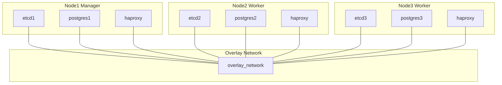

# Database Architecture in Docker Swarm

The compose files are designed for running with Docker Swarm, which communicates
nodes through the overlay network. This allows non-IP communication between services.
Is compatible with AWS EC2 instances.

- [Stack](https://docs.docker.com/engine/swarm/stack-deploy/): A collection of services that make up an application in a swarm.
- [Service](https://docs.docker.com/engine/swarm/how-swarm-mode-works/services/): An application that runs on a swarm.
- [Container](https://docs.docker.com/engine/swarm/how-swarm-mode-works/services/#images-and-containers): A process that runs on a node in a swarm.
- [Swarm](https://docs.docker.com/engine/swarm/how-swarm-mode-works/nodes/): A cluster of Docker Engines that are joined together to run services.

Necessary open ports:

| Port  | Protocol | Description                                                                                 |
|-------|----------|---------------------------------------------------------------------------------------------|
| 2376  | TCP      | Secure Docker client communication. Required for Docker Machine to orchestrate Docker hosts.|
| 2377  | TCP      | Communication between the nodes of a Docker Swarm or cluster. Open on manager nodes only.   |
| 7946  | TCP/UDP  | Communication among nodes for container network discovery.                                  |
| 4789  | UDP      | Overlay network traffic for container ingress networking.                                   |
| 22    | TCP      | SSH into instances remotely.                                                                |
| 5432  | TCP      | Postgres database communication.                                                            |
| 8008  | TCP      | Patroni REST API communication.                                                             |

## Ansible, Swarm and Stack

The current project uses Ansible for deploying the Compose files, but it is not 
required. The compose files inside `ansible` folder can be spawn locally in the
manager node.

There are some examples using Stack instead explicit services, but limited support
for generating configuration.

See [ansible README](ansible/README.md).

