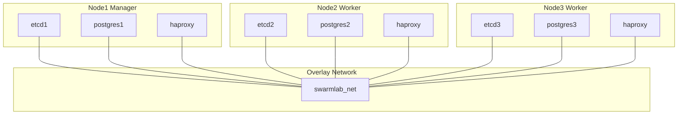

- [Docker Compose for Spilo](https://github.com/zalando/spilo/blob/master/postgres-appliance/tests/docker-compose.yml)
- [Compose Citus](https://github.com/patroni/patroni/blob/master/docker-compose-citus.yml)
- [HAProxy](https://www.haproxy.com/documentation/haproxy-configuration-manual/latest/)


```bash
ansible-playbook 005_spilo_image.yaml
ansible-playbook 105_spilo_deploy.yaml
```

Requires to install a client for `psql`.

Connect and execute:

```bash
CREATE EXTENSION IF NOT EXISTS timescaledb;
```


